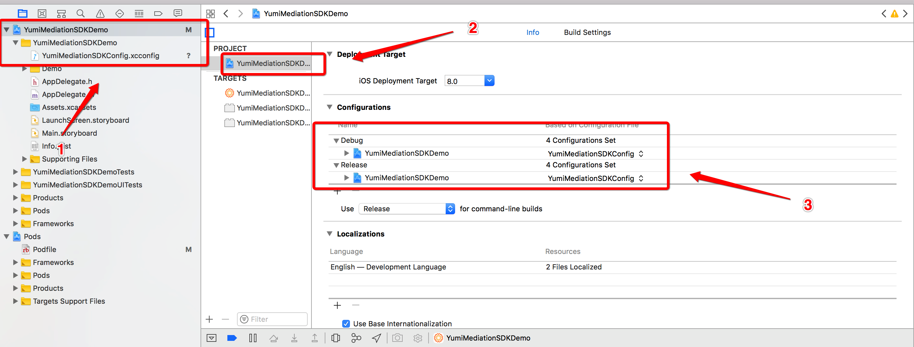

[TOC]

# YumiMediationSDK iOS -Swift

## 概述

1. 面向人群

   本产品主要面向需要在 iOS 产品中接入玉米移动广告 SDK 的开发人员。

2. 开发环境

   Xcode 7.0 或更高版本。

   iOS 8.0 或更高版本。

3. [Demo 获取地址](https://github.com/yumimobi/YumiMediationSDKDemo-iOS.git)         

## 开发环境配置

### App Transport Security

WWDC 15 提出的 ATS (App Transport Security) 是 Apple 在推进网络通讯安全的一个重要方式。在 iOS 9 及以上版本中，默认非 HTTPS 的网络访问是被禁止的。

因为大部分广告物料以 HTTP 形式提供，为提高广告填充率，请进行以下设置：

```objective-c
<key>NSAppTransportSecurity</key>
<dict>
    <key>NSAllowsArbitraryLoads</key>
    <true/>
</dict>
```


*当 `NSAllowsArbitraryLoads` 和 `NSAllowsArbitraryLoadsInWebContent` 或 `NSAllowsArbitraryLoadsForMedia` 同时存在时，根据系统不同，表现的行为也会不一样。简单说，iOS 9 只看 `NSAllowsArbitraryLoads`，而 iOS 10 会优先看 `InWebContent` 和 `ForMedia` 的部分。在 iOS 10 中，要是后两者存在的话，在相关部分就会忽略掉 `NSAllowsArbitraryLoads`；如果不存在，则遵循 `NSAllowsArbitraryLoads` 的设定。*

### iOS 9 及以上系统相关权限

应用程序上传 App Store, 请在 info.plist 文件中添加以下权限。

```objective-c
<-- 日历 -->
<key>NSCalendarsUsageDescription</key>
<string>App需要您的同意,才能访问日历</string>
<!-- 相册 -->
<key>NSPhotoLibraryUsageDescription</key>
<string>App需要您的同意,才能访问相册</string>
```
## 接入方式

#### CocoaPods (推荐)

CocoaPods 是 iOS 的依赖管理工具，使用它可以轻松管理 YumiMediationSDK。

打开您工程的 Podfile，选择下面其中一种方式添加到您应用的 target。

如果您是初次使用 CocoaPods，请查阅 [CocoaPods Guides](https://guides.cocoapods.org/using/using-cocoapods.html) 。

 保证您的Podfile中```use_frameworks!```没有被注释

1. 如果您只需要 YumiMediationSDK 

   ```ruby
   pod "YumiMediationSDK"
   ```

2. 如果您需要聚合其他平台

   ```ruby
   pod "YumiMediationAdapters", :subspecs => ['AdColony','AdMob','AppLovin','Baidu','Chartboost','Domob','Facebook','GDT','InMobi','IronSource','StartApp','Unity','Vungle','PlayableAds','Centrixlink','Mobvista','OneWay','TouTiao']
   ```

接下来在命令行界面中运行：

```ruby
$ pod install --repo-update
```

最终通过 workspace 打开工程。

#### 手动集成 YumiMediationSDK

1. 三方 SDK 选择

2. 三方 SDK 下载

3. YumiMediationSDK 下载

4. 添加 YumiMediationSDK 到您的工程

 

 

5. 配置脚本

按照如图所示步骤，添加 YumiMediationSDKConfig.xcconfig

 

6. 导入 Framework

导入如图所示的系统动态库。

 

#### 创建Objective-C和Swift的桥接

1、如果您的工程中没有Objective-C和Swift的桥接文件，则需要创建桥接文件,命名为ProjectName-Bridging-Header.h


2、设置Objective-C Bridging Header


**注意**：ProjectName-Bridging-Header.h的路劲一定要设置正确

3、按照您需要的广告类型导入YumiMediationSDK的头文件到ProjectName-Bridging-Header.h

```
#import <YumiMediationSDK/YumiMediationBannerView.h>
#import <YumiMediationSDK/YumiMediationInterstitial.h>
#import <YumiMediationSDK/YumiMediationVideo.h>
#import <YumiMediationSDK/YumiMediationNativeAd.h>
#import <YumiMediationSDK/YumiAdsSplash.h>
```


## 代码集成示例

### 广告形式

#### Banner

##### 初始化及请求横幅

```objective-c
class ViewController: UIViewController,YumiMediationBannerViewDelegate{
  
 override func viewDidLoad() {
        super.viewDidLoad()
        banner! .loadAd(true)
        self.view.addSubview(banner!)
    }
   lazy var banner:YumiMediationBannerView? = {
        var  _banner: YumiMediationBannerView = YumiMediationBannerView.init(placementID: "Your PlacementID", channelID: "Your channelID", versionID: "Your versionID", position: YumiMediationBannerPosition.bottom, rootViewController: self)
        _banner.delegate = self
        return _banner
    }()
}
```

##### 移除 Banner

```objective-c
//remove yumiBanner
 if (banner != nil){
            banner! .removeFromSuperview()
            banner = nil
        }
```

##### 实现代理方法 

```objective-c
  //MARK: ------ YumiMediationBannerViewDelegate
    func yumiMediationBannerViewDidLoad(_ adView: YumiMediationBannerView) {
        print("yumiMediationBannerViewDidLoad")
    }
    func yumiMediationBannerViewDidClick(_ adView: YumiMediationBannerView) {
        print("click banner")
    }
    func yumiMediationBannerView(_ adView: YumiMediationBannerView, didFailWithError error: YumiMediationError) {
        print(error)
    }
```

##### 自适应功能

```objective-c
banner!.loadAd(isSmartBanner: Bool)
```

您在请求 `banner` 广告的同时可以设置是否开启自适应功能。

如果设置 `isSmartBanner` 为 `ture` ,YumiMediationBannerView 将会自动根据设备的尺寸进行适配。

此时您可以通过下面的方法获取 YumiMediationBannerView 的尺寸。

```objective-c
banner!.fetchBannerAdSize()
```

   

​	*非自适应模式* 		  *自适应模式*										

#### Interstitial

##### 初始化及请求插屏

```objective-c
class ViewController: UIViewController,YumiMediationInterstitialDelegate{
   var interstitial: YumiMediationInterstitial?
      override func viewDidLoad() {
        super.viewDidLoad()
		 self.interstitial = YumiMediationInterstitial.init(placementID: "Your PlacementID", channelID: "Your channelID", versionID: "Your versionID", rootViewController: self)
        self.interstitial!.delegate = self
    }
}
```

##### 展示插屏

```objective-c
if self.interstitial!.isReady() {
            self.interstitial!.present()
        }
```

##### 实现代理方法

```objective-c
 //MARK: -- YumiMediationInterstitialDelegate
    func yumiMediationInterstitialDidReceiveAd(_ interstitial: YumiMediationInterstitial) {
        print("yumiMediationInterstitialDidReceiveAd")
    }
    func yumiMediationInterstitial(_ interstitial: YumiMediationInterstitial, didFailWithError error: YumiMediationError) {
        print("intersitital error" , error)
    }
    func yumiMediationInterstitialDidClick(_ interstitial: YumiMediationInterstitial) {
        print("click interstitial")
    }
    func yumiMediationInterstitialWillDismissScreen(_ interstitial: YumiMediationInterstitial) {
        print("close interstitial")
    }
```

#### Rewarded Video

##### 初始化及请求视频

```objective-c
class ViewController: UIViewController,YumiMediationVideoDelegate{
let video : YumiMediationVideo = YumiMediationVideo.sharedInstance()
      override func viewDidLoad() {
        super.viewDidLoad()
		   self.video.loadAd(withPlacementID: "Your PlacementID", channelID: "Your channelID", versionID: "Your versionID")
        self.video.delegate = self
    }
}
```

##### 展示视频

```objective-c
  if self.video.isReady(){
            self.video.present(fromRootViewController: self)
        }
```

##### 实现代理方法

```objective-c
 //MARK -- YumiMediationVideoDelegate
    func yumiMediationVideoDidOpen(_ video: YumiMediationVideo) {
        print("open video ")
    }
    func yumiMediationVideoDidReward(_ video: YumiMediationVideo) {
        print("video reward ")
    }
    
    func yumiMediationVideoDidClose(_ video: YumiMediationVideo) {
        print("video close")
    }
    func yumiMediationVideoDidStartPlaying(_ video: YumiMediationVideo) {
        print("start playing")
    }
```

#### Splash

##### 初始化及展示开屏

为了保证开屏的展示，我们推荐尽量在 App 启动时开始执行下面的方法。

例如：在您 `AppDelegate.swift` 的 `application(_ application: UIApplication, didFinishLaunchingWithOptions launchOptions:` 方法中。

######展示全屏广告

```objective-c
//appKey 为预留字段，可填空字符串。
  YumiAdsSplash.sharedInstance().show(with: "Your PlacementID", appKey: "", rootViewController: (self.window?.rootViewController!)! , delegate: self)
```

###### 展示半屏广告

```objective-c
//appKey 为预留字段，可填空字符串。
 let  view  = UIView.init(frame: CGRect.init(x: 0, y: UIScreen.main.bounds.size.height-100, width: UIScreen.main.bounds.size.width, height: 100))
        YumiAdsSplash.sharedInstance().show(with: "Your PlacementID", appKey: "", customBottomView: view, rootViewController: (self.window?.rootViewController!)!, delegate: self)
```

##### 实现代理方法

```objective-c
 //MARK: -- YumiAdsSplashDelegate
    func yumiAdsSplashDefaultImage() -> UIImage? {
        return nil // //Your default image when app start
    }
    func yumiAdsSplashDidLoad(_ splash: YumiAdsSplash) {
        print("splash did load ")
    }
    func yumiAdsSplashDidClosed(_ splash: YumiAdsSplash) {
        print("splash did closed ")
    }
    func yumiAdsSplashDidClicked(_ splash: YumiAdsSplash) {
        print("splash did click")
    }
    func yumiAdsSplash(_ splash: YumiAdsSplash, didFailToLoad error: Error) {
        print("splash error:  ",error)
    }
```

#### Native

##### 初始化及请求

```objective-c
class ViewController: UIViewController,YumiMediationBannerViewDelegate{
  
 override func viewDidLoad() {
        super.viewDidLoad()
       self.native.loadAd(1) // request ad number 
    }
   lazy var native :YumiMediationNativeAd = {
        var _native:YumiMediationNativeAd =  YumiMediationNativeAd.init(placementID: nativePlacementID, channelID: channelID, versionID: versionID)
        _native.delegate = self
        return _native
    }()
}
```

##### Register View

```objective-c
/**
 注册用来渲染广告的 View
 - Parameter view: 渲染广告的 View.
 - Parameter viewController: 将用于当前的ui SKStoreProductViewController(iTunes商店产品信息)或	应用程序的浏览器。
 整个渲染区域可点击。
 */
 self.native.registerView(forInteraction: UIView, with: UIViewController?, nativeAd: YumiMediationNativeModel)
```

##### Report Impression

```objective-c
/**
 当原生广告被展示时调用此方法
 - Parameter nativeAd: 将要被展示的广告对象.
 - Parameter view: 用来渲染广告的 View.
*/
 self.native.reportImpression(YumiMediationNativeModel, view: UIView)
```

##### 实现代理方法

```objective-c
/// Tells the delegate that an ad has been successfully loaded.
  func yumiMediationNativeAdDidLoad(_ nativeAdArray: [YumiMediationNativeModel]) {
      print("yumiMediationNativeAdDidLoad")
  }
  func yumiMediationNativeAdDidClick(_ nativeAd: YumiMediationNativeModel) {
      print("native did click")
  }
  func yumiMediationNativeAd(_ nativeAd: YumiMediationNativeAd, didFailWithError error: YumiMediationError) {
      print("native --" ,error)
  }
```

## 调试模式

如果您想调试平台key是否有广告返回，可选择调试模式。

调用调试模式之前，请保证您的 app 已经初始化 YumiMediationSDK 。

### 接入方式

- CocoaPods（推荐）

  ```ruby
  pod "YumiMediationDebugCenter-iOS" 
  ```


- 手动方式

  将下载好的``YumiMediationDebugCenter-iOS.framework``加入``Xcode``工程即可。 

### 调用调试模式

`#import <YumiMediationDebugCenter-iOS/YumiMediationDebugController.h>` 导入ProjectName-Bridging-Header.h文件

```objective-c
YumiMediationDebugController.sharedInstance().present(withPlacementID: "Your placementID", channelID: "Your channelID", versionID: "Your versionID", rootViewController: self)
```

### 图示


  										*选择平台类型*


 								   *选择单一平台，灰色平台为已添加未配置*


​									*选择广告类型，调试单一平台*


